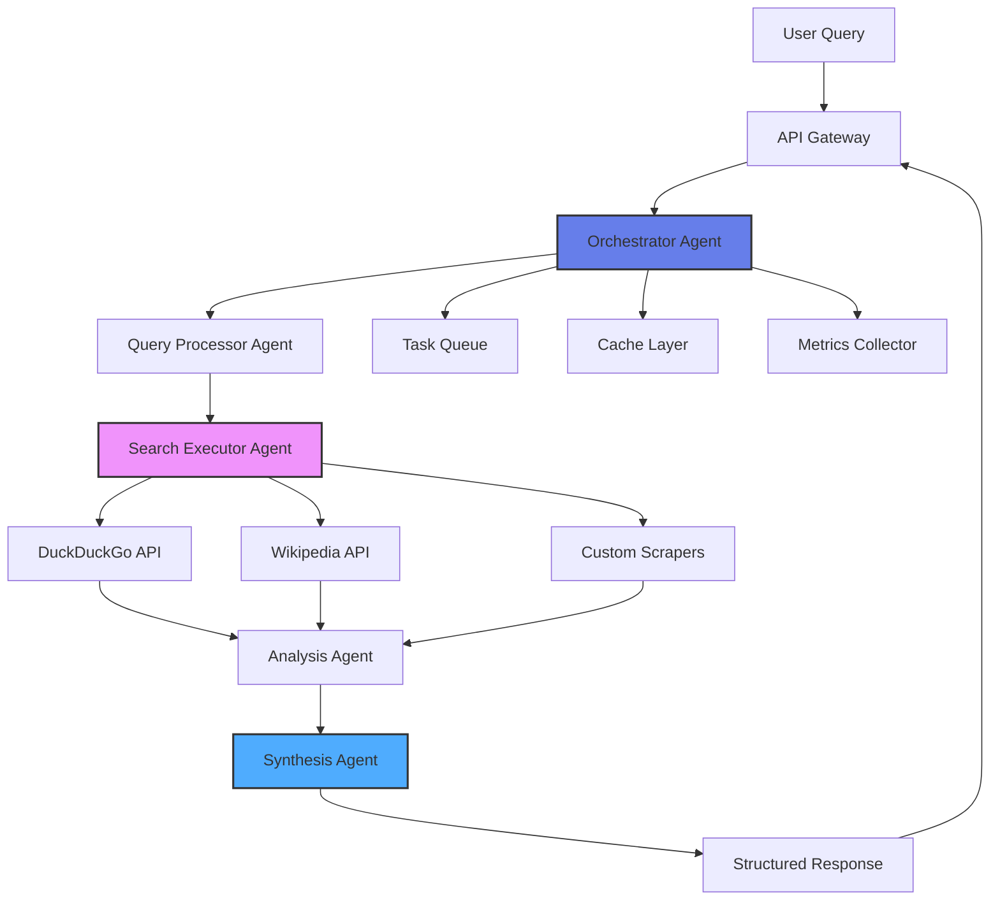

# 🤖 Multi-Agent Web Search & Analysis System

[](https://www.python.org/)
[](https://fastapi.tiangolo.com/)
[](LICENSE)

A production-grade multi-agent orchestration system that coordinates specialized AI agents to perform intelligent web searches, analyze results, and synthesize comprehensive answers using open-source technologies.

## 🎯 Project Overview

This system demonstrates advanced distributed systems and agent orchestration capabilities essential for building scalable AI infrastructure - similar to systems used by modern search engines, AI assistants, and research platforms.

**Key Capabilities:**
- Multi-agent coordination and task distribution
- Intelligent query processing and expansion
- Parallel web search execution across multiple sources
- Result ranking and relevance scoring
- Answer synthesis from multiple sources
- Agent performance monitoring and metrics

## ✨ Features

### Agent Architecture
- **Query Processor Agent**: Analyzes queries, extracts intent, generates search variations
- **Search Executor Agent**: Performs parallel searches across multiple engines
- **Analysis Agent**: Ranks results, scores relevance, filters low-quality content
- **Synthesis Agent**: Combines information from multiple sources into coherent answers
- **Orchestrator**: Coordinates all agents, manages workflows, handles failures

### Search Capabilities
- **Multi-Source Search**: Query multiple search APIs simultaneously
- **Query Expansion**: Generate related search terms automatically
- **Intelligent Ranking**: Score results by relevance, recency, authority
- **Deduplication**: Remove duplicate results across sources
- **Content Extraction**: Pull key information from web pages

### System Features
- **Async Processing**: Non-blocking agent coordination
- **Task Queue**: Handle multiple queries concurrently
- **Caching**: Cache search results to reduce API calls
- **Monitoring**: Track agent performance and execution time
- **Error Handling**: Graceful degradation when agents fail

## 🏗️ Architecture


## 🛠️ Tech Stack

- **Framework**: FastAPI (async Python web framework)
- **Agents**: Custom agent framework with task distribution
- **Search APIs**: DuckDuckGo (no API key), Wikipedia, RSS feeds
- **Web Scraping**: BeautifulSoup4, Requests
- **Caching**: In-memory cache (upgradeable to Redis)
- **Queue**: Python asyncio queues
- **Monitoring**: Custom metrics collection

## 📦 Installation

### Prerequisites
- Python 3.8 or higher
- pip

### Setup

1. **Clone the repository**
```bash
git clone https://github.com/sanikpatige/multi-agent-search-system.git
cd multi-agent-search-system
```

2. **Install dependencies**
```bash
pip install -r requirements.txt
```

3. **Run the server**
```bash
python app.py
```

4. **Access the API**
- API: `http://localhost:8000`
- Interactive docs: `http://localhost:8000/docs`
- Health check: `http://localhost:8000/health`

## 🚀 Usage

### Perform a Search
```bash
curl -X POST "http://localhost:8000/search" \
  -H "Content-Type: application/json" \
  -d '{
    "query": "latest developments in quantum computing",
    "max_results": 10,
    "enable_analysis": true
  }'
```

### Response Format
```json
{
  "query": "latest developments in quantum computing",
  "results": [
    {
      "title": "Breakthrough in Quantum Error Correction",
      "url": "https://example.com/article",
      "snippet": "Researchers achieve 99.9% accuracy...",
      "relevance_score": 0.95,
      "source": "duckduckgo",
      "timestamp": "2025-01-05T10:30:00"
    }
  ],
  "synthesis": {
    "summary": "Recent quantum computing developments focus on...",
    "key_points": [
      "Error correction improvements",
      "New qubit designs",
      "Commercial applications"
    ],
    "confidence": 0.87
  },
  "agent_metrics": {
    "total_time_ms": 1250,
    "query_processing_ms": 45,
    "search_execution_ms": 890,
    "analysis_ms": 215,
    "synthesis_ms": 100,
    "agents_used": ["QueryProcessor", "SearchExecutor", "AnalysisAgent", "SynthesisAgent"]
  }
}
```

### Get Agent Status
```bash
curl "http://localhost:8000/agents/status"
```

### View Agent Metrics
```bash
curl "http://localhost:8000/metrics"
```

## 📊 API Endpoints

### Search Operations

| Method | Endpoint | Description |
|--------|----------|-------------|
| POST | `/search` | Execute multi-agent search |
| POST | `/search/async` | Start async search task |
| GET | `/search/task/{task_id}` | Get async task status |
| GET | `/search/history` | Get search history |

### Agent Management

| Method | Endpoint | Description |
|--------|----------|-------------|
| GET | `/agents/status` | Get all agent statuses |
| GET | `/agents/{agent_name}` | Get specific agent info |
| POST | `/agents/{agent_name}/restart` | Restart an agent |

### System

| Method | Endpoint | Description |
|--------|----------|-------------|
| GET | `/health` | System health check |
| GET | `/metrics` | Performance metrics |
| DELETE | `/cache/clear` | Clear result cache |

## 📁 Project Structure
```
multi-agent-search-system/
├── app.py                      # Main FastAPI application
├── agents/
│   ├── __init__.py
│   ├── base_agent.py          # Base agent class
│   ├── orchestrator.py        # Main orchestrator
│   ├── query_processor.py     # Query analysis agent
│   ├── search_executor.py     # Search execution agent
│   ├── analysis_agent.py      # Result analysis agent
│   └── synthesis_agent.py     # Answer synthesis agent
├── models.py                   # Pydantic data models
├── cache.py                    # Caching layer
├── metrics.py                  # Metrics collection
├── requirements.txt            # Python dependencies
├── test_search.py             # Test script
├── README.md                   # This file
└── LICENSE                     # MIT License
```

## 🎓 Skills Demonstrated

### Distributed Systems
✅ **Multi-Agent Coordination**: Orchestrate multiple autonomous agents  
✅ **Async Processing**: Non-blocking concurrent operations  
✅ **Task Distribution**: Load balancing across agents  
✅ **Fault Tolerance**: Graceful handling of agent failures  

### Systems Engineering
✅ **Scalable Architecture**: Designed for horizontal scaling  
✅ **Caching Strategy**: Reduce redundant operations  
✅ **Monitoring & Metrics**: Track system performance  
✅ **Error Recovery**: Automatic retry and fallback mechanisms  

### Backend Development
✅ **RESTful API**: Clean API design  
✅ **Data Modeling**: Structured request/response formats  
✅ **Queue Management**: Handle concurrent requests  
✅ **Resource Management**: Efficient API usage  

### AI/ML Integration
✅ **Agent-Based Systems**: Autonomous agent design  
✅ **NLP Processing**: Query understanding and expansion  
✅ **Relevance Ranking**: ML-style scoring algorithms  
✅ **Information Synthesis**: Multi-source aggregation  

## 🔍 Technical Highlights

### Agent Coordination
```python
class Orchestrator:
    """
    Central coordinator that manages agent lifecycle
    and task distribution
    """
    async def execute_search(self, query):
        # 1. Process query
        processed = await self.query_agent.process(query)
        
        # 2. Execute searches in parallel
        results = await self.search_agent.search_parallel(processed)
        
        # 3. Analyze and rank
        analyzed = await self.analysis_agent.analyze(results)
        
        # 4. Synthesize answer
        synthesis = await self.synthesis_agent.synthesize(analyzed)
        
        return synthesis
```

### Parallel Search Execution
```python
async def search_parallel(self, queries):
    """
    Execute searches across multiple sources concurrently
    """
    tasks = [
        self.search_duckduckgo(query),
        self.search_wikipedia(query),
        self.search_custom(query)
    ]
    
    results = await asyncio.gather(*tasks, return_exceptions=True)
    return self.merge_results(results)
```

### Relevance Scoring
```python
def calculate_relevance(self, result, query):
    """
    Multi-factor relevance scoring:
    - Keyword matching
    - Title relevance
    - Source authority
    - Recency
    """
    score = 0.0
    score += self.keyword_score(result, query) * 0.4
    score += self.title_score(result, query) * 0.3
    score += self.source_score(result) * 0.2
    score += self.recency_score(result) * 0.1
    return score
```

## 🧪 Testing

### Run Test Search
```bash
# Test with sample queries
python test_search.py
```

### Manual Testing
```bash
# Simple query
curl -X POST "http://localhost:8000/search" \
  -H "Content-Type: application/json" \
  -d '{"query": "Python asyncio tutorial", "max_results": 5}'

# Advanced query with analysis
curl -X POST "http://localhost:8000/search" \
  -H "Content-Type: application/json" \
  -d '{
    "query": "machine learning best practices",
    "max_results": 15,
    "enable_analysis": true,
    "include_synthesis": true
  }'
```

### Check Agent Status
```bash
curl "http://localhost:8000/agents/status"
```

## 📈 Use Cases

### 1. Research Assistant
Gather information from multiple sources for research papers or reports.

### 2. Competitive Intelligence
Monitor competitor activities and industry trends automatically.

### 3. Content Aggregation
Collect and summarize news/articles on specific topics.

### 4. Question Answering System
Build intelligent Q&A systems that search and synthesize answers.

### 5. Market Research
Aggregate market data and insights from various sources.

## 🚀 Agent Workflow
```
User Query
    ↓
Query Processor Agent
    ├── Extract intent
    ├── Generate variations
    └── Identify key terms
    ↓
Search Executor Agent
    ├── Search DuckDuckGo
    ├── Search Wikipedia
    └── Custom scrapers
    ↓
Analysis Agent
    ├── Score relevance
    ├── Filter duplicates
    └── Rank results
    ↓
Synthesis Agent
    ├── Extract key info
    ├── Generate summary
    └── List key points
    ↓
Structured Response
```

## 🔧 Configuration

Edit agent behavior by modifying agent parameters:
```python
# In agents/orchestrator.py
ORCHESTRATOR_CONFIG = {
    "max_concurrent_searches": 5,
    "search_timeout_seconds": 30,
    "enable_caching": True,
    "cache_ttl_seconds": 3600,
    "retry_attempts": 3,
    "min_relevance_score": 0.3
}
```

## 📊 Performance Metrics

The system tracks:
- **Query processing time**: Time to analyze query
- **Search execution time**: Parallel search duration
- **Analysis time**: Result ranking duration
- **Synthesis time**: Answer generation duration
- **Total pipeline time**: End-to-end latency
- **Cache hit rate**: Percentage of cached results
- **Agent success rate**: Successful task completion %

## 🚀 Future Enhancements

- [ ] Machine learning for relevance ranking
- [ ] More search source integrations (Google, Bing)
- [ ] Advanced NLP for query understanding
- [ ] Redis/Memcached for distributed caching
- [ ] Kubernetes deployment manifests
- [ ] WebSocket for real-time updates
- [ ] Agent learning from user feedback
- [ ] Multi-language support
- [ ] GraphQL API option

## 🤝 Related to Amazon Systems Development Engineer Role

This project demonstrates skills directly applicable to:

| Job Aspect | Project Feature |
|-----------|----------------|
| Distributed systems | Multi-agent coordination |
| Scalable architecture | Async processing, caching |
| Real-time processing | Concurrent search execution |
| Service orchestration | Agent workflow management |
| Monitoring & observability | Metrics collection |
| Fault tolerance | Error handling, retries |

**Real-world parallel**: Similar to how Amazon builds:
- Alexa's multi-skill orchestration
- Product search systems
- Recommendation engines
- Distributed microservices

## 🎯 Design Principles

### 1. Modularity
Each agent is independent and can be upgraded/replaced without affecting others.

### 2. Scalability
Agents can be distributed across multiple processes/machines.

### 3. Resilience
System continues working even if individual agents fail.

### 4. Observability
All agent actions are logged and metrics are collected.

### 5. Extensibility
Easy to add new agent types or search sources.

## 📝 License

MIT License - see LICENSE file

## 👤 Author

**Sanik Patige**
- GitHub: [@sanikpatige](https://github.com/sanikpatige)


---

⭐ Star this repo if you find it useful for building agent systems!
